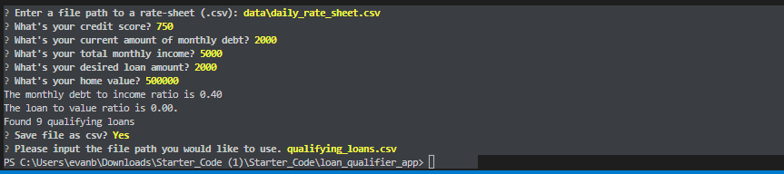

# Project Title

Just after the title, introduce your project by describing attractively what the project is about and what is the main problem that inspires you to create this project or what is the main contribution for the potential user of your project.

---

## Technologies

Describe the technologies required to use your project such as programming languages, libraries, frameworks, and operating systems. Be sure to include the specific versions of any critical dependencies that you have used in the stable version of your project.


The following project uses python 3.10.6 with These third party packages 


[Questionary - For the User Dialogs And Prompts](https://github.com/tmbo/questionary)

[Google Fire- For the Command line interface](https://github.com/google/python-fire)


---
---

## Installation Guide

Install Dependancies Fire, and questionary using PIP package manager. This will not work without the packages.

```python
  pip install questionary
  pip install fire

```

## Usage

This section should include screenshots, code blocks, or animations explaining how to use your project.


---

## Contributors

In this section, list all the people who contribute to this project. You might want recruiters or potential collaborators to reach you, so include your contact email and, optionally, your LinkedIn or Twitter profile.

---

## License
MIT License

Copyright (c) 2022 qfed1

Permission is hereby granted, free of charge, to any person obtaining a copy
of this software and associated documentation files (the "Software"), to deal
in the Software without restriction, including without limitation the rights
to use, copy, modify, merge, publish, distribute, sublicense, and/or sell
copies of the Software, and to permit persons to whom the Software is
furnished to do so, subject to the following conditions:

The above copyright notice and this permission notice shall be included in all
copies or substantial portions of the Software.

THE SOFTWARE IS PROVIDED "AS IS", WITHOUT WARRANTY OF ANY KIND, EXPRESS OR
IMPLIED, INCLUDING BUT NOT LIMITED TO THE WARRANTIES OF MERCHANTABILITY,
FITNESS FOR A PARTICULAR PURPOSE AND NONINFRINGEMENT. IN NO EVENT SHALL THE
AUTHORS OR COPYRIGHT HOLDERS BE LIABLE FOR ANY CLAIM, DAMAGES OR OTHER
LIABILITY, WHETHER IN AN ACTION OF CONTRACT, TORT OR OTHERWISE, ARISING FROM,
OUT OF OR IN CONNECTION WITH THE SOFTWARE OR THE USE OR OTHER DEALINGS IN THE
SOFTWARE.
